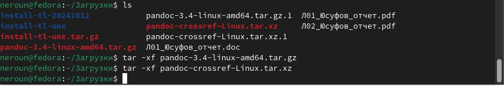
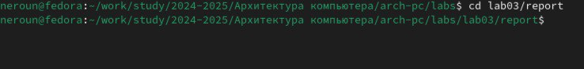

---
## Front matter
title: "Отчет по лабораторной работе №3"
subtitle: "Дисциплина: архитектура компьютера"
author: "Юсуфов Джабар Артикович"

## Generic otions
lang: ru-RU

## Bibliography
bibliography: bib/cite.bib
csl: pandoc/csl/gost-r-7-0-5-2008-numeric.csl

## Pdf output format
toc: true # Table of contents
toc-depth: 2
lof: true # List of figures
lot: true # List of tables
fontsize: 12pt
linestretch: 1.5
papersize: a4
documentclass: scrreprt
## I18n polyglossia
polyglossia-lang:
  name: russian
  options:
	- spelling=modern
	- babelshorthands=true
polyglossia-otherlangs:
  name: english
## I18n babel
babel-lang: russian
babel-otherlangs: english
## Fonts
mainfont: PT Serif
romanfont: PT Serif
sansfont:  PT Sans
monofont: PT Mono
mathfont: STIX Two Math
mainfontoptions: Ligatures=TeX
romanfontoptions: Ligatures=TeX
sansfontoptions: Ligatures=TeX,Scale=MatchLowercase
monofontoptions: Scale=MatchLowercase,Scale=0.9
mathfontoptions:
## Biblatex
biblatex: true
biblio-style: "gost-numeric"
biblatexoptions:
  - parentracker=true
  - backend=biber
  - hyperref=auto
  - language=auto
  - autolang=other*
  - citestyle=gost-numeric
## Pandoc-crossref LaTeX customization
figureTitle: "Рис."
tableTitle: "Таблица"
listingTitle: "Листинг"
lofTitle: "Список иллюстраций"
lotTitle: "Список таблиц"
lolTitle: "Листинги"
## Misc options
indent: true
header-includes:
  - \usepackage{indentfirst}
  - \usepackage{float} # keep figures where there are in the text
  - \floatplacement{figure}{H} # keep figures where there are in the text
---

# **Цель работы.**
 
Целью данной лабораторной работы является освоение процедуры оформелния отчетов с помощью легковесного языка разметки Markdown.

# **Выполнение лабораторной работы.**

## **Установка необходимого ПО**

### **Установка TexLive**

Скачала TexLive с официального сайта. Распаковываю архив.

Перехожу в распакованную папку с помощью cd. Запускаю скрипт install-tl-* с правами root, используя sudo в начале команды.

Добавляю /usr/local/texlive/2022/bin/x86_64-linux в свой PATH для текущей и будущих сессий

### **Установка pandoc и pandoc-crossref.**

Скачиваю архив pandoc версии 3.4.

Скачиваю архив pandoc-crossref 0.3.18.0.

Распаковываю скачанные архивы.

Копирую файлы pandoc и pandoc-crossref в каталог /usr/local/bin/ с правами пользователя root с помощью sudo.

Проверяю корректность выполненных действий.

## **Заполнение отчета по выполнению лабораторной работы №3 с помощью языка разметки Markdown.**

Открываю терминал. Перехожу в каталог курса, сформированный при выполненнии прошлой лаборатной работы.

Обновляю локальный репозиторий, скачав изменения из удаленного репозитория с помощью команды git pull.

Перехожу в каталог с шаблоном отчета по лабораторной работе №3 с помощью cd.

Компилирую шаблон с использованием Makefile, вводя команду make.

Открываю сгенерированный файл report.docx LibreOffice.

Открываю сгенерированный файл report.pdf. Убедился, что все правильно сгенерировалось.

Удаляю полученные файлы с использованием Makefile, вводя команду make clean (рис. [-@fig:015]). С помощью команды ls проверяю, удалились ли созданные файлы.

Открываю файл report.md с помощью любого текстового редактора mousepad.

Я хочу, чтобы у меня на всякий случай сохранился шаблон отчета, поэтому копирую файл с новым названием с помощью утилиты cp.

Начинаю заполнять отчет с помощью языка разметки Markdown в скопированном файле.

Компилирую файл с отчетом. Загружаю отчет на GitHub.

## **Задание для самостоятельной работы.**

Выполняю лабораторную работу № 2 с помощью языка разметки Makrdown. Загружаю отчет на GitHub.

## **Вывод**

В результате выполнения данной лабораторной работы я освоил процедуры оформления отчетов с помощью легковесного языка разметки Markdown.
