---
## Front matter
title: "Отчет по лабораторной работе №4"
subtitle: "Дисциплина: архитектура компьютера"
author: "Юсуфов Джабар Артикович"

## Generic otions
lang: ru-RU

## Bibliography
bibliography: bib/cite.bib
csl: pandoc/csl/gost-r-7-0-5-2008-numeric.csl

## Pdf output format
toc: true # Table of contents
toc-depth: 2
lof: true # List of figures
lot: true # List of tables
fontsize: 12pt
linestretch: 1.5
papersize: a4
documentclass: scrreprt
## I18n polyglossia
polyglossia-lang:
  name: russian
  options:
	- spelling=modern
	- babelshorthands=true
polyglossia-otherlangs:
  name: english
## I18n babel
babel-lang: russian
babel-otherlangs: english
## Fonts
mainfont: PT Serif
romanfont: PT Serif
sansfont: PT Sans
monofont: PT Mono
mathfont: STIX Two Math
mainfontoptions: Ligatures=TeX
romanfontoptions: Ligatures=TeX
sansfontoptions: Ligatures=TeX,Scale=MatchLowercase
monofontoptions: Scale=MatchLowercase,Scale=0.9
mathfontoptions:
## Biblatex
biblatex: true
biblio-style: "gost-numeric"
biblatexoptions:
  - parentracker=true
  - backend=biber
  - hyperref=auto
  - language=auto
  - autolang=other*
  - citestyle=gost-numeric
## Pandoc-crossref LaTeX customization
figureTitle: "Рис."
tableTitle: "Таблица"
listingTitle: "Листинг"
lofTitle: "Список иллюстраций"
lotTitle: "Список таблиц"
lolTitle: "Листинги"
## Misc options
indent: true
header-includes:
  - \usepackage{indentfirst}
  - \usepackage{float} # keep figures where there are in the text
  - \floatplacement{figure}{H} # keep figures where there are in the text
---

# **Цель работы**

Цель данной лабораторной работы - освоить процедуры компиляции и сборки программ, написанных на ассемблере NASM

# **Задание**

1. Создание программы Hello world!
2. Работа с транслятором NASM.
3. Работа с расширенным синтаксисом командной строки NASM.
4. Работа с компоновщиком LD.
5. Запуск исполняемого файла. 
6. Выполнение заданий для самостоятельной работы.

# **Выполнение лабораторной работы**

## **Создание программы Hello world!**

С помощью утилиты cd перемещаюсь в каталог, в котором буду работать.
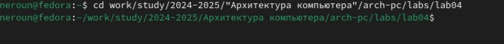

Создаю в текущем каталоге пустой текстовый файл hello.asm с помощью утилиты touch.
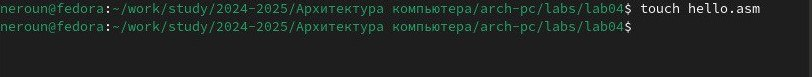

Открываю созданный файл в текстовом редакторе mousepad.
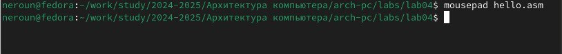

Заполняю файл, вставляя в него программу для вывода "Hello world!".
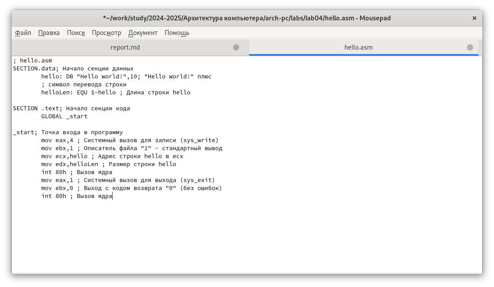

## **Работа с транслятором NASM.**

Превращаю текст программы для вывода "Hello world!" в объектный код с помощью транлятора NASM, используя команду nasm -f elf hello.asm, ключ -f указывает транслятору nasm, что требуется создать бинарный файл в формате ELF. Далее проверяю правильность выполнения команды с помощью утилиты ls: действительно, создан файл "hello.o".
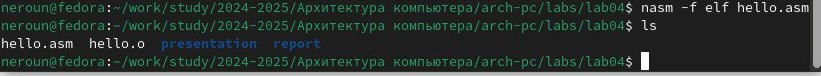

## **Работа с расширенным синтаксисом командной строки NASM.**

Ввожу команду, которая скомпилирует файл hello.asm в файл obj.o, при этом в файл будут включены символы для откладки (ключ -g), также с помощью ключа -l будет создан файл листинга list.lst. Далее проверяю с помощью утилиты ls правильность выполнения команды.
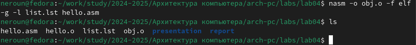

## **Работа с компоновщиком Ld.**

Передаю объектный файл hello.o на обработку компоновщику LD, чтобы получить исполняемый файл hello. Ключ -о задает имя создаваемого исполняемого файла. Далее проверяю с помощью утилиты ls правильность выполнения команды.
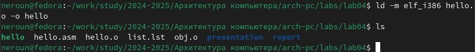

Выполняю следующую команду. Исполняемый файл будет иметь имя main, т.к. после ключа -о было задано значение main. Объектный файл, из которого собран этот исполняемый файл, имеет имя obj.o .
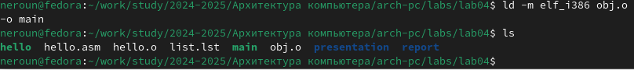

## **Запуск исполняемого файла.**

Запускаю на выполнение созданный исполняемый файл hello.
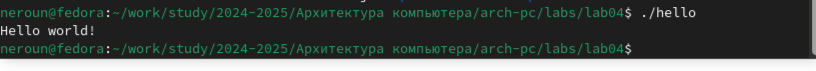

## **Выполнение заданий для самостоятельной работы.**

С помощью утилиты cp создаю в текущем каталоге копию файла hello.asm с именем lab5.asm.
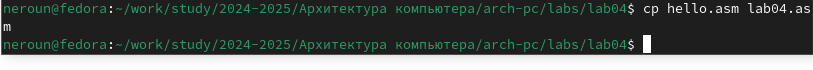

С помощью текстового редактора mousepad открываю файл lab5.asm и вношу изменения в программу так, чтобы она выводила мои имя и фамилию.
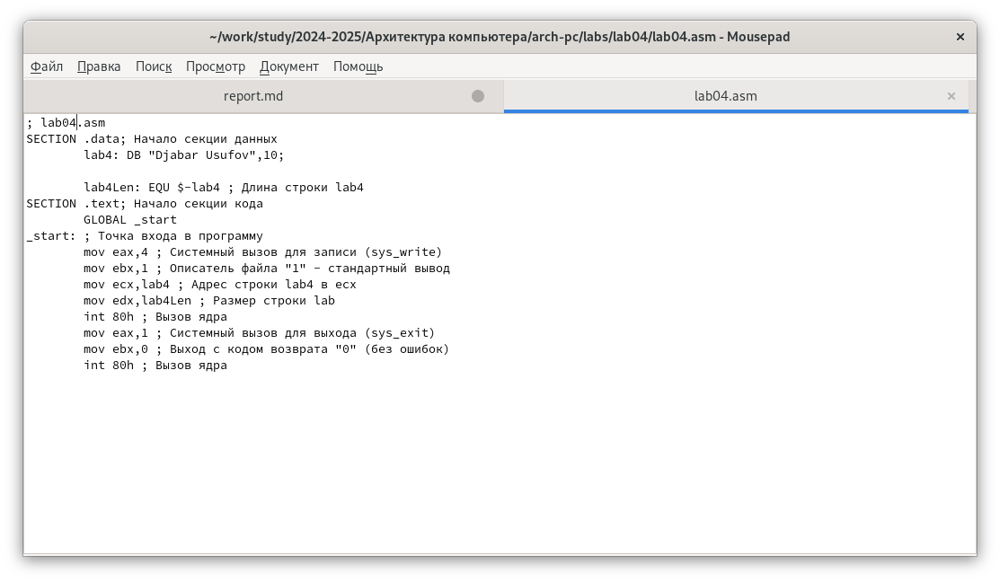

Компилирую текст программы в объектный файл. Проверяю с помощью утилиты ls, что файл lab5.o создан.
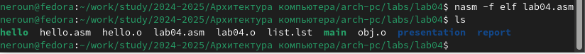

Передаю объектный файл lab5.o на обработку компоновщику LD, чтобы получить исполняемый файл lab5.
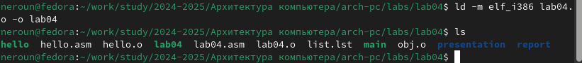

Запускаю исполняемый файл lab5, на экран действительно выводятся мои имя и фамилия.
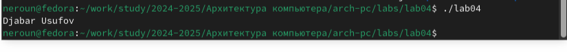

К сожалению, я начал работу не в том каталоге, поэтому создаю другую директорию lab05 с помощью mkdir, прописывая полный путь к каталогу, в котором хочу создать эту директорию. Далее копирую из текущего каталога файлы, созданные в процессе выполнения лабораторной работы, с помощью утилиты cp, указывая вместо имени файла символ *, чтобы скопировать все файлы. Команда проигнорирует директории в этом каталоге, т. к. не указан ключ -r, это мне и нужно . Проверяю с помощью утилиты ls правильность выполнения команды.
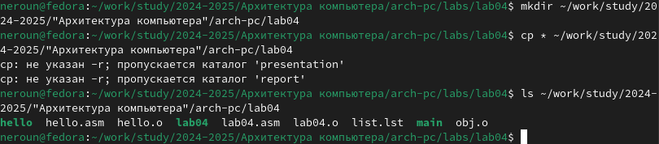

Удаляю лишние файлы в текущем каталоге с помощью утилиты rm, ведь копии файлов остались в другой директории
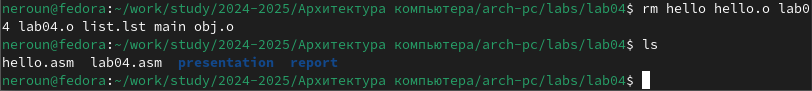

С помощью команд git add . и git commit добавляю файлы на GitHub.

# Выводы

При выполнении данной лабораторной работы я освоил процедуры компиляции и сборки программ, написанных на ассемблере NASM.

