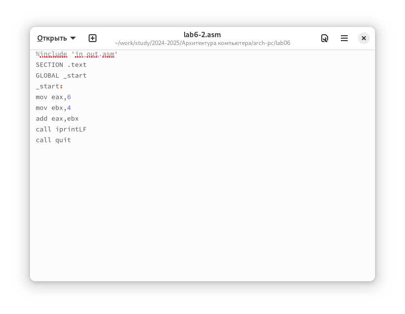

---
## Front matter
title: "Отчет по лабораторной работе №6"
subtitle: "Дисциплина: Архитектура компьютера"
author: "Юсуфов Джабар Артикович"

## Generic otions
lang: ru-RU
toc-title: "Содержание"

## Bibliography
bibliography: bib/cite.bib
csl: pandoc/csl/gost-r-7-0-5-2008-numeric.csl

## Pdf output format
toc: true # Table of contents
toc-depth: 2
lof: true # List of figures
lot: true # List of tables
fontsize: 12pt
linestretch: 1.5
papersize: a4
documentclass: scrreprt
## I18n polyglossia
polyglossia-lang:
  name: russian
  options:
	- spelling=modern
	- babelshorthands=true
polyglossia-otherlangs:
  name: english
## I18n babel
babel-lang: russian
babel-otherlangs: english
## Fonts
mainfont: PT Serif
romanfont: PT Serif
sansfont: PT Sans
monofont: PT Mono
mathfont: STIX Two Math
mainfontoptions: Ligatures=TeX
romanfontoptions: Ligatures=TeX
sansfontoptions: Ligatures=TeX,Scale=MatchLowercase
monofontoptions: Scale=MatchLowercase,Scale=0.9
mathfontoptions:
## Biblatex
biblatex: true
biblio-style: "gost-numeric"
biblatexoptions:
  - parentracker=true
  - backend=biber
  - hyperref=auto
  - language=auto
  - autolang=other*
  - citestyle=gost-numeric
## Pandoc-crossref LaTeX customization
figureTitle: "Рис."
tableTitle: "Таблица"
listingTitle: "Листинг"
lofTitle: "Список иллюстраций"
lotTitle: "Список таблиц"
lolTitle: "Листинги"
## Misc options
indent: true
header-includes:
  - \usepackage{indentfirst}
  - \usepackage{float} # keep figures where there are in the text
  - \floatplacement{figure}{H} # keep figures where there are in the text
---

# **Цель работы**

Цель данной лабораторной работы - освоение арифметических инструкций языка ассемблера NASM.

# **Задание**

1. Символьные и численные данные в NASM.
2. Выполнение арифметических операций в NASM.
3. Выполнение заданий для самостоятельной работы.

# **Выполнение лабораторной работы**

## **Символьные и численные данные в NASM.**

С помощью утилиты mkdir создаю директорию, в которой буду создавать файлы с программами для лабораторной работы №6. Перехожу в созданный каталог с помощью утилиты cd.

С помощью утилиты touch создаю файл lab6-1.asm.

Копирую в текущий каталог файл in_out.asm с помощью утилиты cp, т.к. он будет использоваться в других программах.

Открываю созданный файл lab6-1.asm, вставляю в него программу вывода значения регистра eax.

Создаю исполняемый файл программы и запускаю его. Вывод программы: символ j, потому что программа вывела символ, соответсвующий по системе ASCII сумме двоичных кодов символов 4 и 6.

Изменяю в тексте программы символы "6" и "4" на цифры 6 и 4.

Создаю новый исполянемый файл программы и запускаю его. Теперь вывелся символ с кодом 10, это символ перевода строки, этот символ не отображается при выводе на экран.

Создаю новый файл lab6-2.asm с помощью утилиты touch.

Ввожу в файл текст другой программы для вывода значения регистра eax.

Создаю и запускаю исполняемый файл lab6-2. Теперь вывод число 106, потому что программа позволяет вывести именно число, а не символ, хотя все еще происходит именно сложение кодов символом "6" и "4".

Заменяю в тексте программы в файле lab6-2.asm символы "6" и "4" на числа 6 и 4.

Создаю и запускаю новый исполняемый файл. Теперь программа складывет не соответствующие символам коды в системе ASCII, а сами числа, поэтому вывод 10.

Заменяю в тексте программы функцию iprintLf на iprint.

Создаю и запускаю новый исполняемый файл. Вывод не изменился, потому что символ переноса строки не отображался, когда программа исполнялась с функцией iprintLF, а iprint не добавляет к выводу символ переноса строки, в отличие от iprintLF.

## **Выполнение арифметических операций в NASM.**

Создаю файл lab6-3.asm с помощью утилиты  touch.

Ввожу в созданный файл текст программы для вычисления значения выражения f(x)=(5*2+3)/3.

Создаю исполняемый файл и запускаю его.

Изменяю программу так, чтобы она вычисляла значение выражения f(x)=(4*6+2)/5

Создаю и запускаю новый исполняемый файл. Я посчитал значение выражения в ручную, программа дала такой же ответ.

Создаю файл variant.asm с помощью утилиты touch.

Ввожу в файл текст программы для вычисления варианта задания по номеру студенческого билета.

Создаю и запускаю исполняемый файл. Ввожу номер своего студенческого билета с клавиатуры, программа вывела, что мой вариант-3.

## **Ответы на вопросы по программе.**

1. За вывод сообщения "Ваш вариант" отвечают строки кода:

mov eax,rem
call sprint

2. Инструкция mox ecx,x используется, чтобы положить адрес вводимой строки х в регистр ecx mov edx,80-запись в регистр edx длины вводимой строки call sread-вызов подпрограммы из внешнего файла, обеспечивающей ввод сообщения с клавиатуры. 

3. call atoi используется для вызова подпрограммы из внешнего файла, которая преобразует ascii-код символа в целое число и записывает результат в регистр eax.

4. За вычисления варианта отвечают строки:

xor edx,edx ; обнуление edx для корректной работы div
mov ebx,20 ; ebx=20
div ebx ; eax=eax/20, edx-остаток от деления
inc edx ; edx= edx+1

5. При выполнении инструкции div ebx остаток от деления записывается в регистр edx.

6. Инструкция inc edx увеличивает значение регистра edx на 1.

7. За вывод на экран результатов вычислений отвечают строки:

mov eax,edx
call iprintLF

## **Выполнение заданий для самостоятельной работы**

Создаю файл lab6-4.asm с помощью утилиты touch.

Открываю файл для редактирования, ввожу в него текст программы для вычисления значения выражения (2+x)^2. Это выражение было под вариантом 3.

Создаю и запускаю исполянемый файл. При вводе значения 2, вывод-16.

Запускаю исполняемый файл еще раз, но с другим значение на входе. Программа верно работает.

# **Выводы**

При выполнении данной лабораторной работы я освоил ариметические инструкции языка ассемблера NASM.