---
## Front matter
title: "Отчет по лабораторной работе №7"
subtitle: "Дисциплина: Архитектура компьютера"
author: "Юсуфов Джабар Артикович"

## Generic otions
lang: ru-RU
toc-title: "Содержание"

## Bibliography
bibliography: bib/cite.bib
csl: pandoc/csl/gost-r-7-0-5-2008-numeric.csl

## Pdf output format
toc: true # Table of contents
toc-depth: 2
lof: true # List of figures
lot: true # List of tables
fontsize: 12pt
linestretch: 1.5
papersize: a4
documentclass: scrreprt
## I18n polyglossia
polyglossia-lang:
  name: russian
  options:
	- spelling=modern
	- babelshorthands=true
polyglossia-otherlangs:
  name: english
## I18n babel
babel-lang: russian
babel-otherlangs: english
## Fonts
mainfont: PT Serif
romanfont: PT Serif
sansfont: PT Sans
monofont: PT Mono
mathfont: STIX Two Math
mainfontoptions: Ligatures=TeX
romanfontoptions: Ligatures=TeX
sansfontoptions: Ligatures=TeX,Scale=MatchLowercase
monofontoptions: Scale=MatchLowercase,Scale=0.9
mathfontoptions:
## Biblatex
biblatex: true
biblio-style: "gost-numeric"
biblatexoptions:
  - parentracker=true
  - backend=biber
  - hyperref=auto
  - language=auto
  - autolang=other*
  - citestyle=gost-numeric
## Pandoc-crossref LaTeX customization
figureTitle: "Рис."
tableTitle: "Таблица"
listingTitle: "Листинг"
lofTitle: "Список иллюстраций"
lotTitle: "Список таблиц"
lolTitle: "Листинги"
## Misc options
indent: true
header-includes:
  - \usepackage{indentfirst}
  - \usepackage{float} # keep figures where there are in the text
  - \floatplacement{figure}{H} # keep figures where there are in the text
---

# **Цель работы**

Изучение команд условного и безусловного переходов. Приобретение навыков написания программ с использованием переходов. Знакомство с назначением и структурой файла листинга.

# **Задание**

1. Реализация переходов в NASM.
2. Изучение структуры файла листинга.
3. Задания для самостоятельной работы.

# **Выполнение лабораторной работы**

## **Реализация переходов в NASM.**

Создаю каталог для программ лабораторной работы №7.
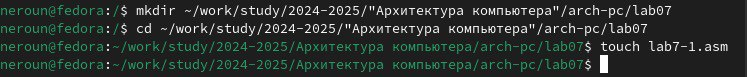

Копирую код из листинга в файл будущей программы.
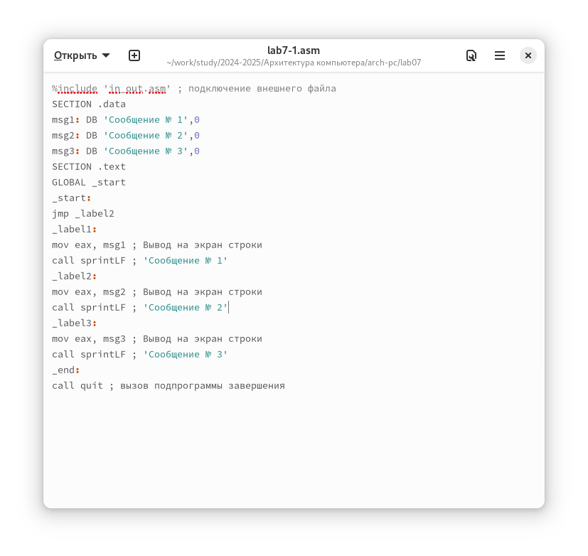

При запуске программы я убедился в том, что неусловный переход действительно изменяет порядок выполнения инструкций.
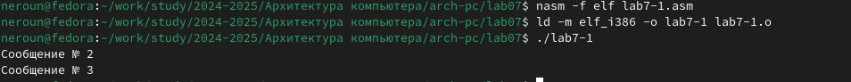

Изменяю программу таким образом, чтобы поменялся порядок выполнения функций.
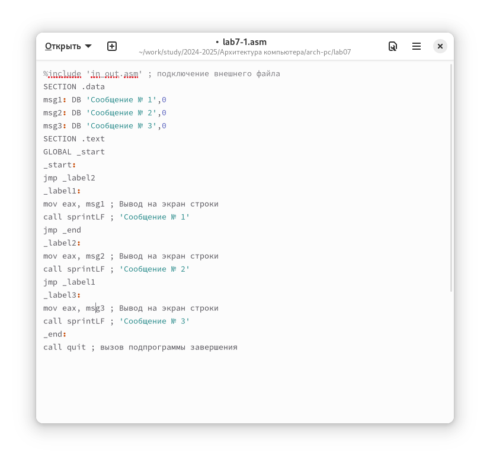

Запускаю программу и проверяю, что примененные изменения верны.
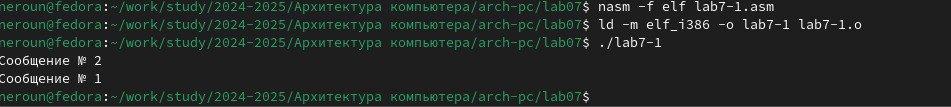

Теперь изменяю текст программы так, чтобы все три сообщения вывелись в обратной порядке.


Работа выполнена корректно, программа в нужном порядке выводит сообщения.
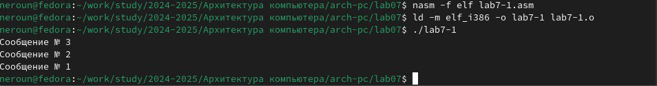

Создаю новый рабочий файл и вставляю в него код из следующего листинга.
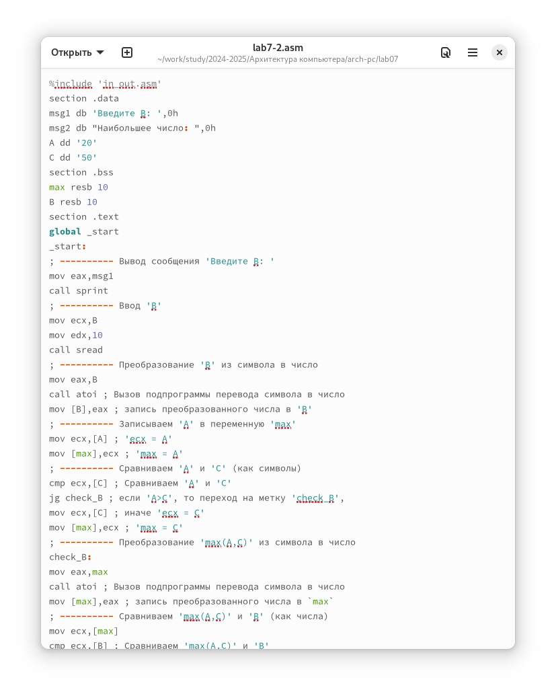

Программа выводит значение переменной с максимальным значением, проверяю работу программы с разными входными данными.
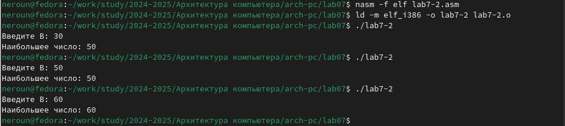

## **Изучение структуры файла листинга**

Создаю файл листинга с помощью ключа -l команды nasm и открываю его с помощью текстового редактора mousepad.
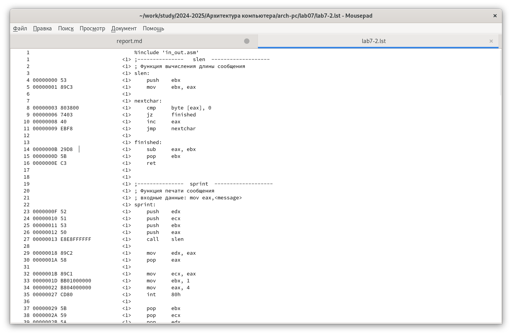
Первое значение в файле листинга - номер строки, и он может вовсе не совпадать с номером строки изначального файла. Второе вхождение - адрес, смещение машинного кода относительно начала текущего сегмента, затем непосредственно идет сам машинный код, а заключает строку исходный текст прогарммы с комментариями.

Удаляю один операнд из случайной инструкции, чтобы проверить поведение файла листинга в дальнейшем
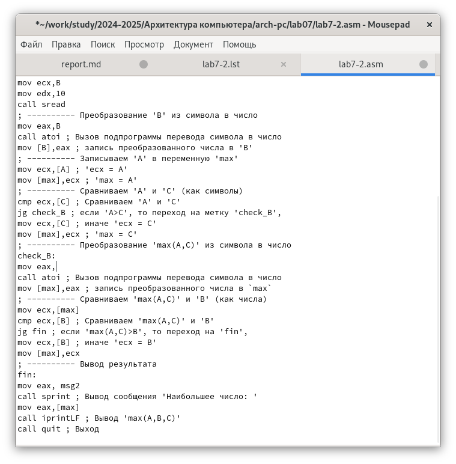

В новом файле листинга показывает ошибку, которая возникла при попытке трансляции файла. Никакие выходные файлы при этом помимо файла листинга не создаются.
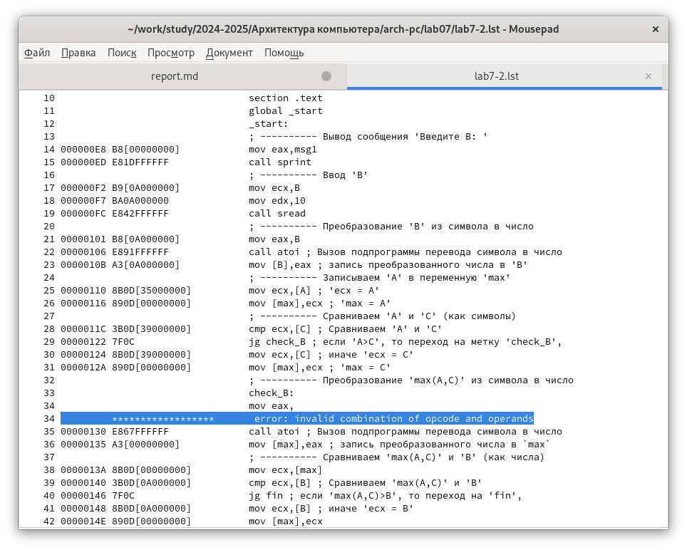

## **Задания для самостоятельной работы.**

Скорее всего в описании задания опечатка и я должен использовать свой вариант 3 из лабораторной работы №6. Возвращаю операнд к функции в программе и изменяю ее так, чтобы она выводила переменную с наименьшим значением.
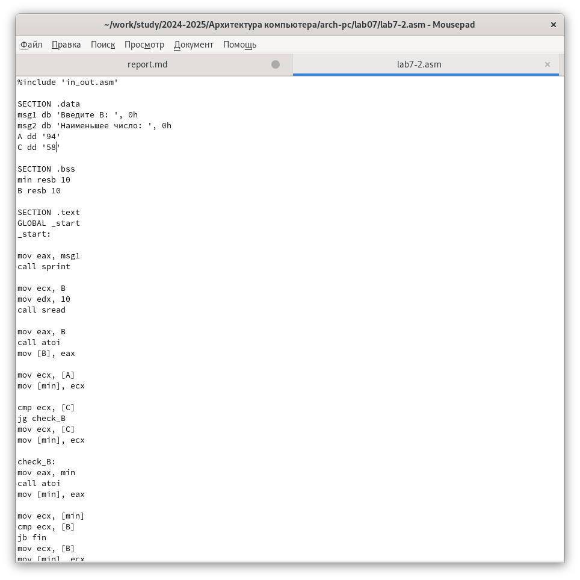

Код первой программы:

```NASM
%include 'in_out.asm'

SECTION .data
msg1 db 'Введите В: ', 0h
msg2 db 'Наименьшее число: ', 0h
A dd '24'
C dd '15'

SECTION .bss
min resb 10
B resb 10

SECTION .text
GLOBAL _start
_start:

mov eax, msg1
call sprint

mov ecx, B
mov edx, 10
call sread

mov eax, B
call atoi
mov [B], eax

mov ecx, [A]
mov [min], ecx

cmp ecx, [C]
jg check_B
mov ecx, [C]
mov [min], ecx

check_B:
mov eax, min
call atoi
mov [min], eax

mov ecx, [min]
cmp ecx, [B]
jb fin
mov ecx, [B]
mov [min], ecx

fin:
mov eax, msg2
call sprint
mov eax, [min]
call iprintLF
call quit
```
Проверяю корректность написания первой программы.
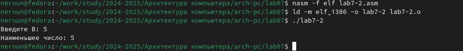


# **Выводы**

При выполнении лабораторной работы я изучил команды условных и безусловных переходво, а также приобрел навыки написания программ с использованием перходов, познакомился с назначением и структурой файлов листинга.


