---
## Front matter
title: "Отчет по лабораторной работе №8"
subtitle: "Дисциплина: Архитектура компьютера"
author: "Юсуфов Джабар Артикович"

## Generic otions
lang: ru-RU
toc-title: "Содержание"

## Bibliography
bibliography: bib/cite.bib
csl: pandoc/csl/gost-r-7-0-5-2008-numeric.csl

## Pdf output format
toc: true # Table of contents
toc-depth: 2
lof: true # List of figures
lot: true # List of tables
fontsize: 12pt
linestretch: 1.5
papersize: a4
documentclass: scrreprt
## I18n polyglossia
polyglossia-lang:
  name: russian
  options:
	- spelling=modern
	- babelshorthands=true
polyglossia-otherlangs:
  name: english
## I18n babel
babel-lang: russian
babel-otherlangs: english
## Fonts
mainfont: Pt Serif
romanfont: PT Serif
sansfont: PT Sans
monofont: PT Mono
mathfont: STIX Two Math
mainfontoptions: Ligatures=TeX
romanfontoptions: Ligatures=TeX
sansfontoptions: Ligatures=TeX,Scale=MatchLowercase
monofontoptions: Scale=MatchLowercase,Scale=0.9
mathfontoptions:
## Biblatex
biblatex: true
biblio-style: "gost-numeric"
biblatexoptions:
  - parentracker=true
  - backend=biber
  - hyperref=auto
  - language=auto
  - autolang=other*
  - citestyle=gost-numeric
## Pandoc-crossref LaTeX customization
figureTitle: "Рис."
tableTitle: "Таблица"
listingTitle: "Листинг"
lofTitle: "Список иллюстраций"
lotTitle: "Список таблиц"
lolTitle: "Листинги"
## Misc options
indent: true
header-includes:
  - \usepackage{indentfirst}
  - \usepackage{float} # keep figures where there are in the text
  - \floatplacement{figure}{H} # keep figures where there are in the text
---

# **Цель работы**

Изучение команд условного и безусловного переходов. Приобретение навыков написания
программ с использованием переходов. Знакомство с назначением и структурой файла
листинга.

# **Задание**

1. Реализация циклов в NASM.
2. Обработка аргументов командной строки.
3. Задания для самостоятельной работы.

# **Выполнение лабораторной работы**

## **Реализация циклов в NASM.**

Создаю каталог для программ лабораторной работы №8.
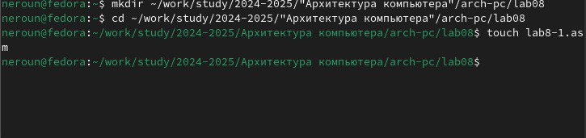

Копирую в созданный файл программу из листинга.
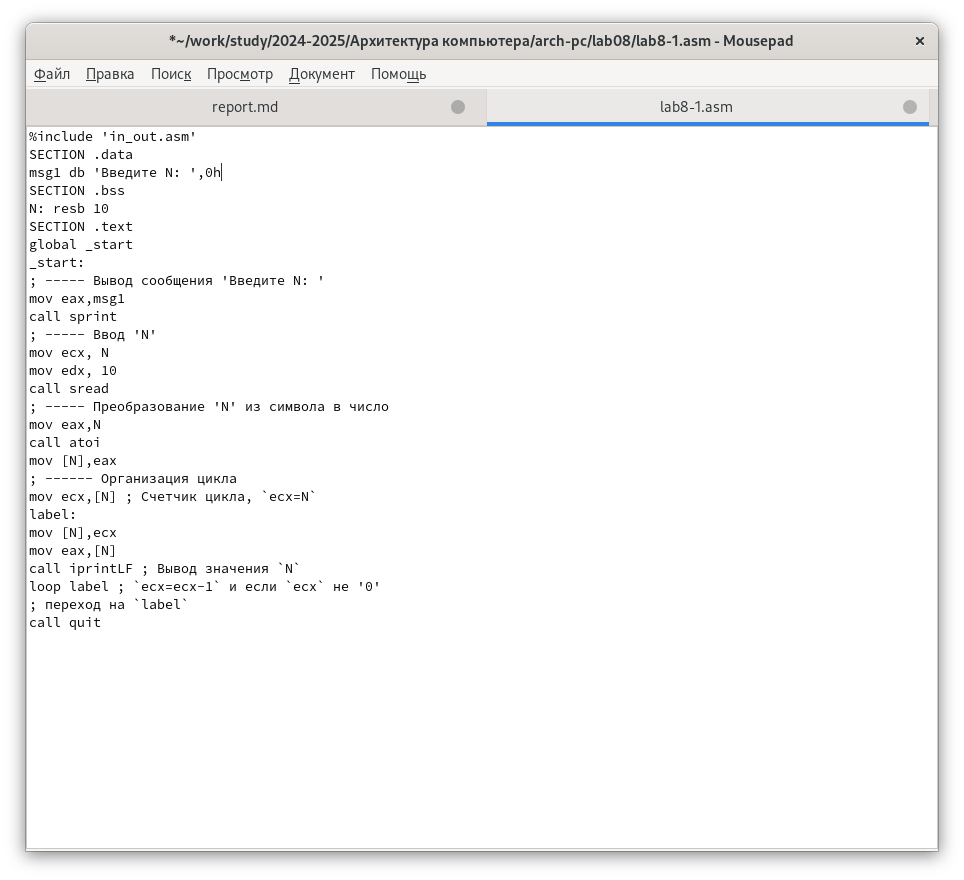

Запускаю программу, она показывает работу циклов в NASM.
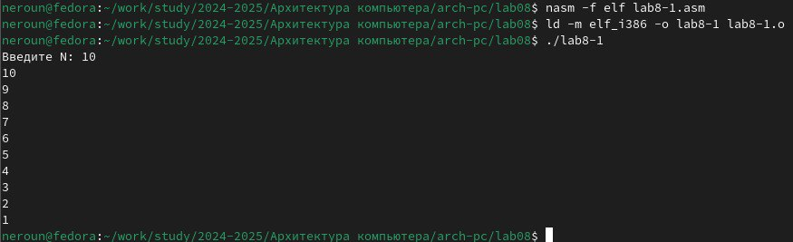

Заменяю программу изначальную так, что в теле цикла я изменяю значение регистра ecx.
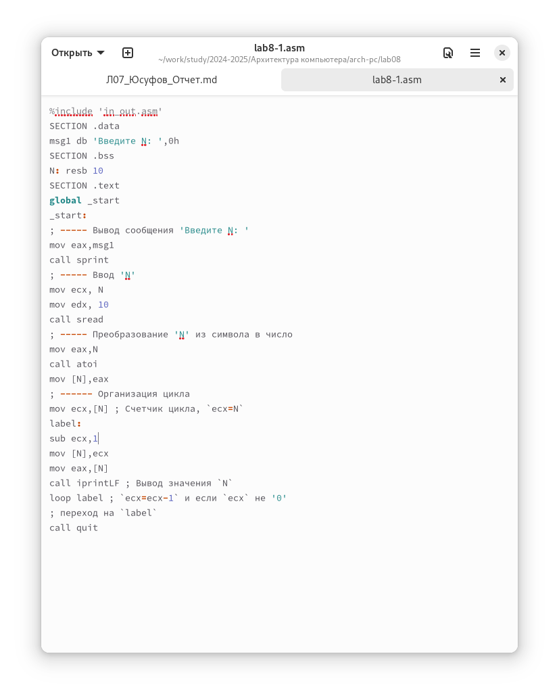

Из-за того, что теперь регистр ecx на каждой итерации уменьшается на 2 значения, количество итераций уменьшается вдвое.
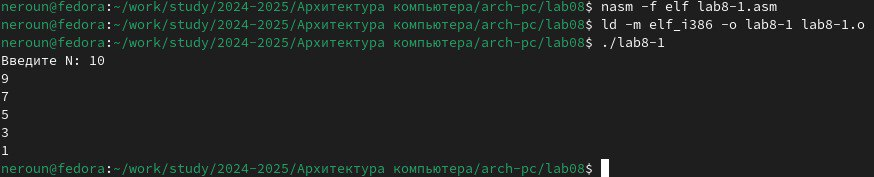

Добавляю команды push и pop в программу.
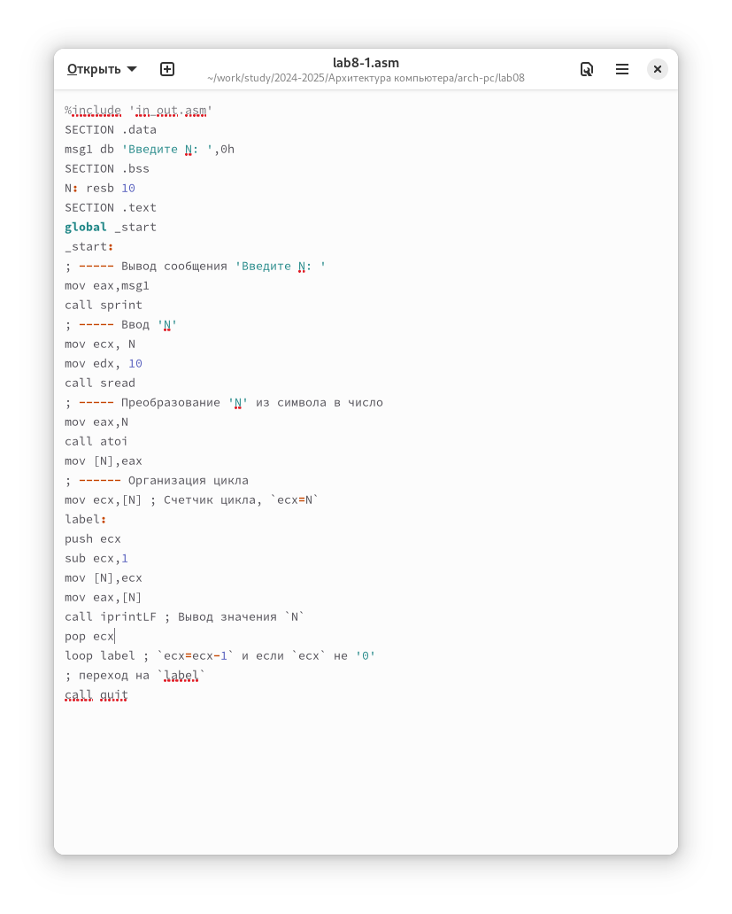

Теперь количество итераций совпадает введенному N, но произошло смещение выводимых чисел на -1.
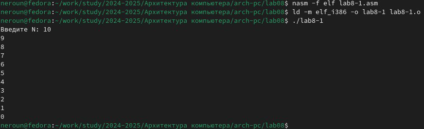

## **Обработка аргументов командной строки**

Создаю новый файл для программы и копирую в него код из следующего листинга.
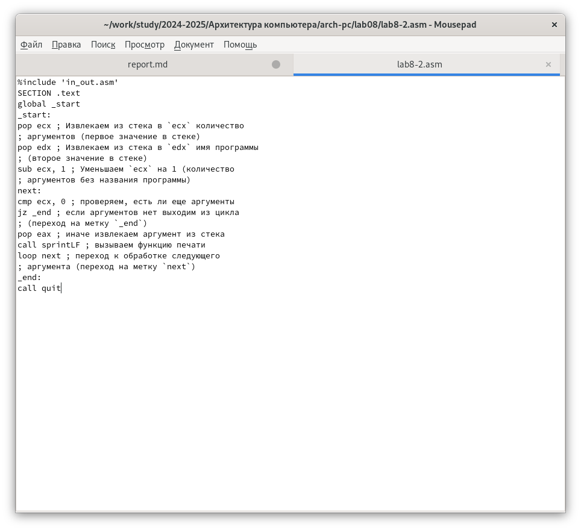

Компилирую программу и запускаю, указав аргументы. Программой было обработано то же количество аргументов, что и было введено.
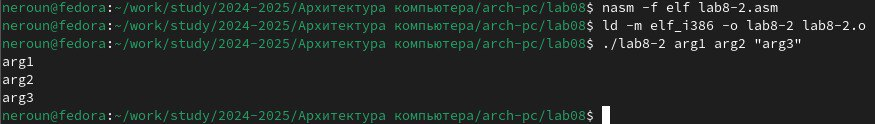

Создаю новый файл для программы и копирую в него код из третьего листинга.
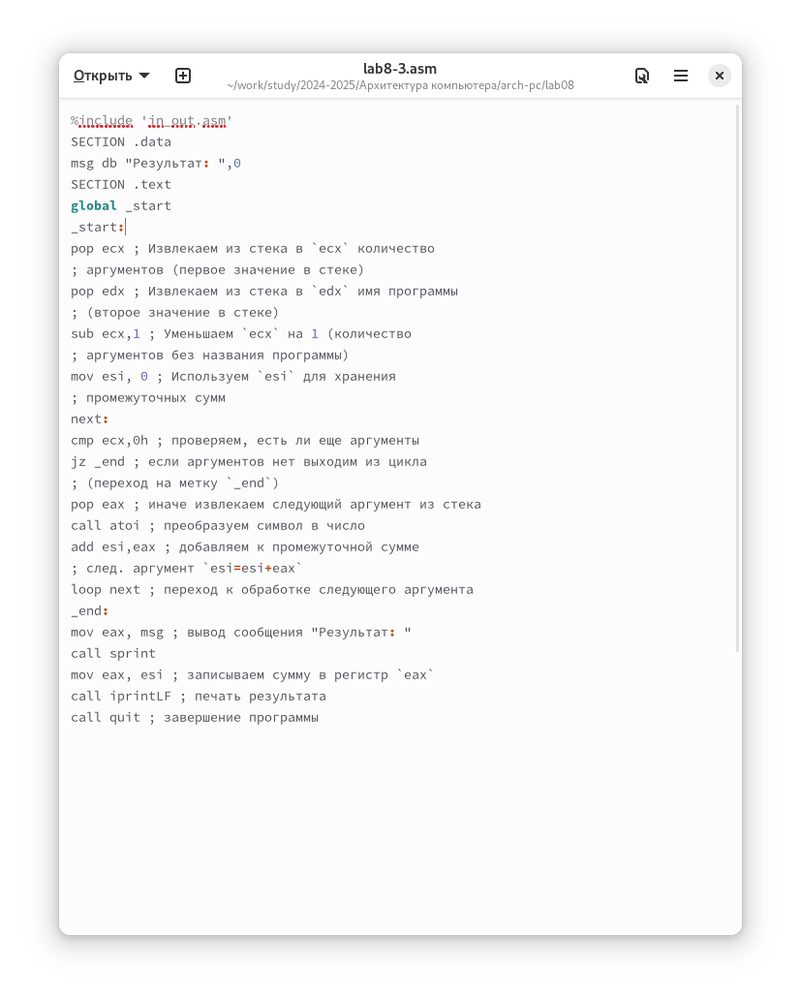

Компилирую программу и запускаю, указав в качестве аргументов некоторые числа, программа их складывает.
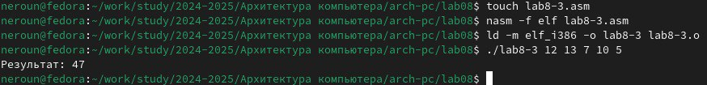

Изменяю поведение программы так, чтобы указанные аргументы она умножала, а не складывала.
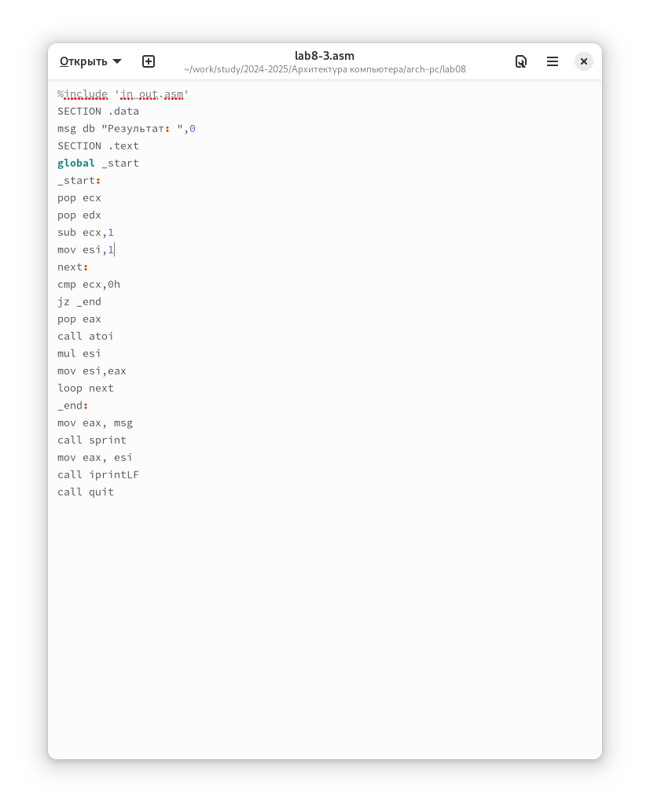

Программа действительно теперь умножает данные на вход числа.
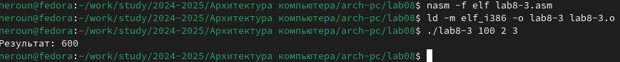

## **Задание для самостоятельной работы.**

Пишу программу, которая будет находить сумма значений для функции f(x) = 10x-5, которая совпадает с моим третьим вариантом.
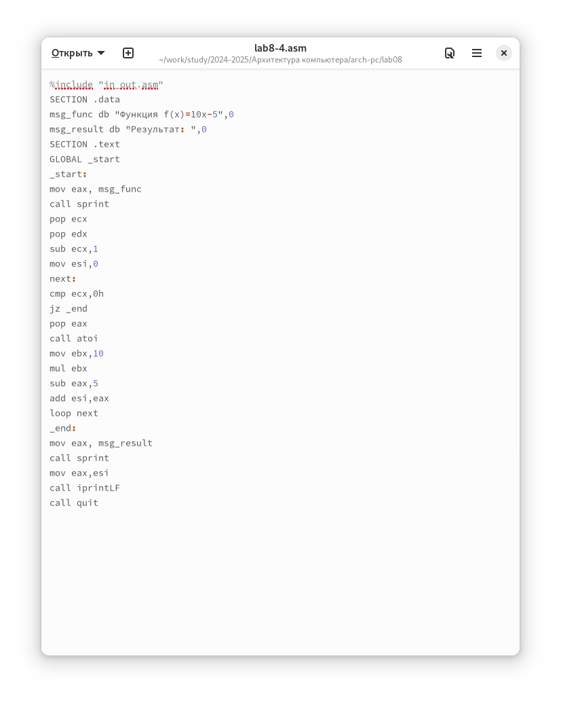

Код программы:

%include 'in_out.asm'
SECTION .data
msg_func db "Функция: f(x) = 10x - 5", 0
msg_result db "Результат: ", 0
SECTION .text
GLOBAL _start
_start:
mov eax, msg_func
call sprintLF
pop ecx
pop edx
sub ecx, 1
mov esi, 0
next:
cmp ecx, 0h
jz _end
pop eax
call atoi
mov ebx, 10
mul ebx
sub eax, 5
add esi, eax
loop next
_end: 
mov eax, msg_result
call sprint
mov eax, esi
call iprintLF
call quit

Проверяю работу программы, указав в качестве аргумента несколько чисел.
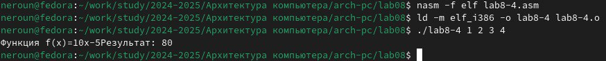

# **Выводы**

В результате выполнения данной лабораторной работы я приобрел навыки написания программ с использованием циклов а также научился обрабатывать аргументы командной строки.

