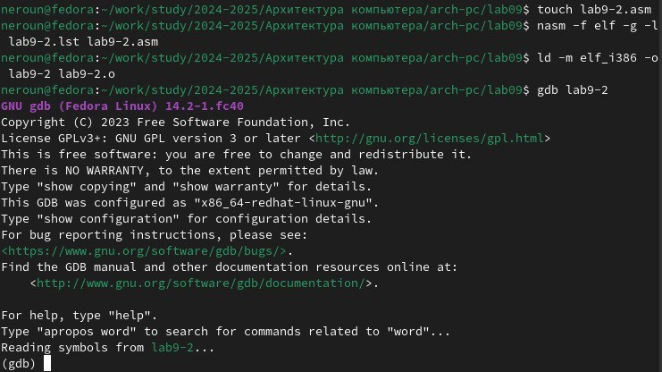

---
## Front matter
title: "Отчет по лабораторной работе №9"
subtitle: "Дисциплина: Архитектура компьютера"
author: "Юсуфов Джабар Артикович"

## Generic otions
lang: ru-RU
toc-title: "Содержание"

## Bibliography
bibliography: bib/cite.bib
csl: pandoc/csl/gost-r-7-0-5-2008-numeric.csl

## Pdf output format
toc: true # Table of contents
toc-depth: 2
lof: true # List of figures
lot: true # List of tables
fontsize: 12pt
linestretch: 1.5
papersize: a4
documentclass: scrreprt
## I18n polyglossia
polyglossia-lang:
  name: russian
  options:
	- spelling=modern
	- babelshorthands=true
polyglossia-otherlangs:
  name: english
## I18n babel
babel-lang: russian
babel-otherlangs: english
## Fonts
mainfont: PT Serif
romanfont: PT Serif
sansfont: PT Sans
monofont: PT Mono
mathfont: STIX Two Math
mainfontoptions: Ligatures=TeX
romanfontoptions: Ligatures=TeX
sansfontoptions: Ligatures=TeX,Scale=MatchLowercase
monofontoptions: Scale=MatchLowercase,Scale=0.9
mathfontoptions:
## Biblatex
biblatex: true
biblio-style: "gost-numeric"
biblatexoptions:
  - parentracker=true
  - backend=biber
  - hyperref=auto
  - language=auto
  - autolang=other*
  - citestyle=gost-numeric
## Pandoc-crossref LaTeX customization
figureTitle: "Рис."
tableTitle: "Таблица"
listingTitle: "Листинг"
lofTitle: "Список иллюстраций"
lotTitle: "Список таблиц"
lolTitle: "Листинги"
## Misc options
indent: true
header-includes:
  - \usepackage{indentfirst}
  - \usepackage{float} # keep figures where there are in the text
  - \floatplacement{figure}{H} # keep figures where there are in the text
---

# **Цель работы**

Приобретение навыков написания программ с использованием подпрограмм. Знакомство
с методами отладки при помощи GDB и его основными возможностями.

# **Задание**

1. Реализация подпрограмм в NASM
2. Отладка программ с помощью GDB
3. Задание для самостоятельной работы.

# **Выполнение лабораторной работы**

## **Реализация подпрограмм в NASM**

Создаю каталог для выполнения лабораторной работы №9.


Копирую в файл код из листинга, компилирую и запускаю его, данная программа выполняет вычисление функции.


Изменяю текст программы, добавив в нее подпрограмму, теперь она вычисляет значение функции для выражения.


Код программы:

```NASM
%include 'in_out.asm'
SECTION .data
msg: DB 'Введите x: ', 0
result: DB '2(3x-1)+7=', 0
SECTION .bss
x: RESB 80
res: RESB 80
SECTION .text
GLOBAL _start
_start:
mov eax, msg
call sprint
mov ecx, x
mov edx, 80
call sread
mov eax, x
call atoi
call _calcul
mov eax, result
call sprint
mov eax, [res]
call iprintLF
call quit
_calcul:
push eax
call _subcalcul
mov ebx, 2
mul ebx
add eax, 7
mov [res], eax
pop eax
ret
_subcalcul:
mov ebx, 3
mul ebx
sub eax, 1
ret
```

### **Отладка программ с помощью GDB**

В созданный файл копирую программу второго листинга, транслирую с созданием файла листинга и отладки, компоную и запускаю в отладчике.


Запустив программу командой run, я убедился в том, что она работает исправно.


Для более подробного анализа программы добавляю брейкпоинт на метку _start и снова запускаю отладку.


Далее смотрю дисассимилированный код программы, перевожу на команды с синтаксисом Intel. Различия между синтаксисом ATT и Intel заключаются в порядке операндов (ATT - Операнд источника указан первым. Intel - Операнд назначения указан первым), их размере (ATT - pазмер операндов указывается явно с помощью суффиксов, непосредственные операнды предваряются символом $; Intel - Размер операндов неявно определяется контекстом, как ax, eax, непосредственные операнды пишутся напрямую), именах регистров(ATT - имена регистров предваряются символом %, Intel - имена регистров пишутся без префиксов).


Включаю режим псевдографики для более удобного анализа программы.


### **Добавление точек останова**

Проверяю в режиме псевдографики, что брейкпоинт сохранился.


Устаналиваю еще одну точку останова по адресу инструкции.


### **Работа с данными программы в GDB**

Просматриваю содержимое регистров командой info registers.


Смотрю содержимое переменных по имени и по адресу.


Меняю содержимое переменных по имени и по адресу.


Вывожу в различных форматах значение регистра edx.


С помощью команды set меняю содержимое регистра ebx.


### **Обработка аргументов командной строки в GDB**

Копирую программу из предыдущей лабораторной работы в текущий каталог и создаю исполняемый файл с файлом листинга и отладки.


Запускаю программу в режиме отладки с указанием аргументов, указываю брейкпопнт и запускаю отладку. Проверяю работу стека, 
изменяя аргумент команды просмотра регистра esp на +4, число обусловлено разрядностью системы, а указатель void занимает как раз 4 байта,
ошибка при аргументе +24 означает, что аргументы на вход программы закончились.


## **Задание для самостоятельной работы**

Меняю программу самостоятельной части предыдущей лабораторной работы с использованием подпрограммы.


Код программы:

```NASM
%include 'in_out.asm'
SECTION .data
msg_func db "Функция: f(x) = 10x - 5", 0
msg_result db "Результат: ", 0
SECTION .text
GLOBAL _start
_start:
mov eax, msg_func
call sprintLF
pop ecx
pop edx
sub ecx, 1
mov esi, 0
next:
cmp ecx, 0h
jz _end
pop eax
call atoi
call _calculate_fx
add esi, eax
loop next
_end: 
mov eax, msg_result
call sprint
mov eax, esi
call iprintLF
call quit
_calculate_fx:
mov ebx, 10
mul ebx
sub eax, 5
```

Запускаю программу в режиме отладчика и пошагово через si просматриваю изменение значений регистров через i r.
При выполнении инструкции mul ecx можно заметить, что результат умножения записывается в регистр eax, но также меняет и edx. 
Значение регистра ebx не обновляется напрямую, поэтому результат программа неверно подсчитывает функцию.


Исправляю найденную ошибку, теперь программа верно считает значение функции.


Код измененной программы: 

```NASM
%include 'in_out.asm'
SECTION .data
div: DB 'Результат: ', 0
SECTION .text
GLOBAL _start
_start:
mov ebx, 3
mov eax, 2
add ebx, eax
mov eax, ebx
mov ecx, 4
mul ecx
add eax, 5
mov edi, eax
mov eax, div
call sprint
mov eax, edi
call iprintLF
call quit 
```

# **Выводы**

В результате выполнения данной лабораторной работы я приобрел навыки написания программ с использованием подпрограмм, а также познакомился с методами отладки
при помомщи GDB и его основными возможностями.
