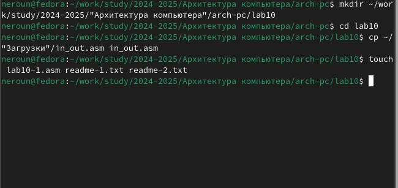
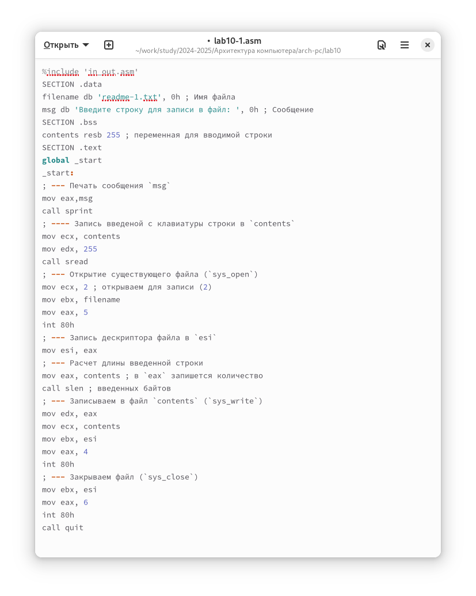
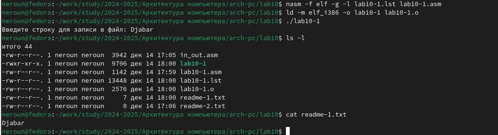
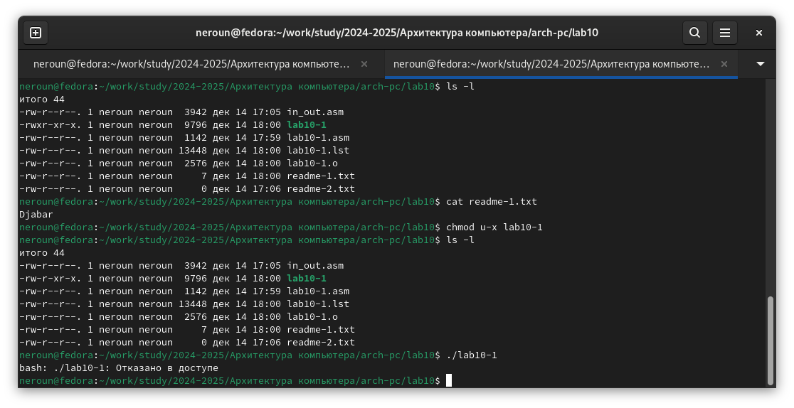
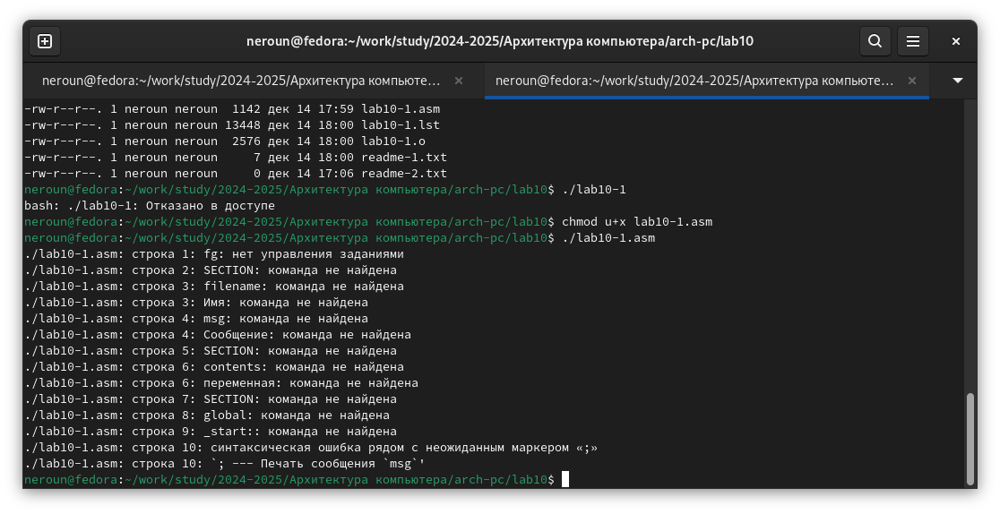
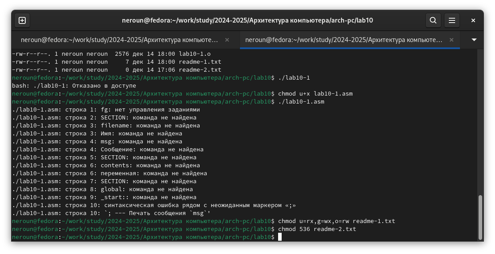
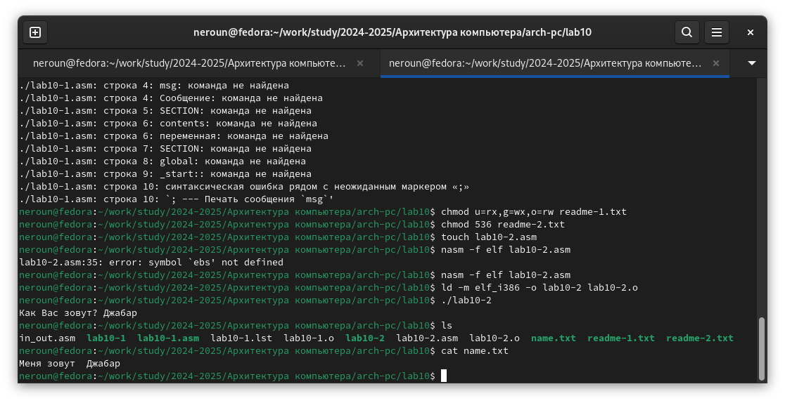

---
## Front matter
title: "Отчет по лабораторной работе №10"
subtitle: "Дисциплина: Архитектура компьютера"
author: "Юсуфов Джабар Артикович"

## Generic otions
lang: ru-RU
toc-title: "Содержание"

## Bibliography
bibliography: bib/cite.bib
csl: pandoc/csl/gost-r-7-0-5-2008-numeric.csl

## Pdf output format
toc: true # Table of contents
toc-depth: 2
lof: true # List of figures
lot: true # List of tables
fontsize: 12pt
linestretch: 1.5
papersize: a4
documentclass: scrreprt
## I18n polyglossia
polyglossia-lang:
  name: russian
  options:
	- spelling=modern
	- babelshorthands=true
polyglossia-otherlangs:
  name: english
## I18n babel
babel-lang: russian
babel-otherlangs: english
## Fonts
mainfont: PT Serif
romanfont: PT Serif
sansfont: PT Sans
monofont: PT Mono
mathfont: STIX Two Math
mainfontoptions: Ligatures=TeX
romanfontoptions: Ligatures=TeX
sansfontoptions: Ligatures=TeX,Scale=MatchLowercase
monofontoptions: Scale=MatchLowercase,Scale=0.9
mathfontoptions:
## Biblatex
biblatex: true
biblio-style: "gost-numeric"
biblatexoptions:
  - parentracker=true
  - backend=biber
  - hyperref=auto
  - language=auto
  - autolang=other*
  - citestyle=gost-numeric
## Pandoc-crossref LaTeX customization
figureTitle: "Рис."
tableTitle: "Таблица"
listingTitle: "Листинг"
lofTitle: "Список иллюстраций"
lotTitle: "Список таблиц"
lolTitle: "Листинги"
## Misc options
indent: true
header-includes:
  - \usepackage{indentfirst}
  - \usepackage{float} # keep figures where there are in the text
  - \floatplacement{figure}{H} # keep figures where there are in the text
---

# **Цель работы**

Приобретение навыков написания программ для работы с файлами.

# **Задание**

1. Создание файлов в программах
2. Изменение прав на файлы для разных групп пользователей
3. Задание для самостоятельной работы.


# **Выполнение лабораторной работы**

Создаю каталог для программ лабораторной работы №10.


Ввожу в созданный файл программу из первого листинга.


Запускаю программу, она просит на ввод строку, 
после чего создает текстовый файл с введенной пользователем строкой.


Меняю права владельца, запретив исполнять файл, 
после чего система отказывает в исполнении файла, 
т.к. я - владелец - запретил самому себе же исполнять программу.


Добавляю к исходному файлу программы права владельцу на исполнение, исполняемый текстовый файл интерпретирует каждую строку как команду, 
так как ни одна из строк не является командой bash, программа абсолютно ничего не делает.


Согласно своему варианту, мне нужно установить соответствующие ему права на текстовые файлы, созданные в начале этой работы:
1. В символьном виде для 1-го readme файла r-x -wx rw-
2. В двоичной системе для 2-го readme файла 011 101 011

Перевожу группу битов в восьмеричную систему, символьную запись подгоняю под синтаксис и получаю нужные аргументы для chmod.


## **Задание для самостоятельной работы**

Пишу программу, транслирую и компилирую. Программа должна выводить приглашение, 
просить ввод с клавиатуры и создавать текстовый файл с указанной в программе строкой и вводом пользователя.
Запускаю программу, проверяю наличие и содержание созданного текстового файла, программа работает корректно


```NASM
%include 'in_out.asm'
SECTION .data
filename db 'name.txt', 0
prompt db 'Как Вас зовут?', 0
intro db 'Меня зовут ', 0
SECTION .bss
name resb 255
SECTION .text
global _start
_start:
mov eax, prompt
call sprint
mov ecx, name
mov edx, 255
call sread
mov eax, 8
mov ebx, filename
mov ecx, 0744o
int 80h
mov esi, eax
mov eax, intro
call slen
mov edx, eax
mov ecx, intro
mov ebx, esi
mov eax, 4
int 80h
mov eax, name
call slen
mov edx, eax
mov ecx, name
mov ebx, esi
mov eax, 4
int 80h
mov ebx,esi
mov eax,6
int 80h
call quit
```

# **Выводы**

В процессе выполнения лабораторной работы я приобрел навыки написания программ для работы с файлами, научился редактировать права для файлов.
